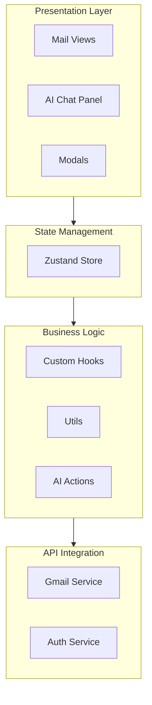
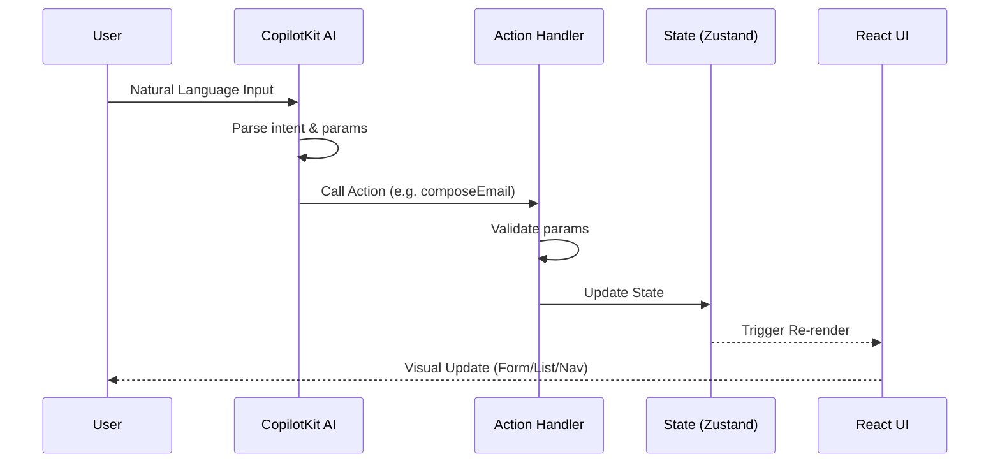
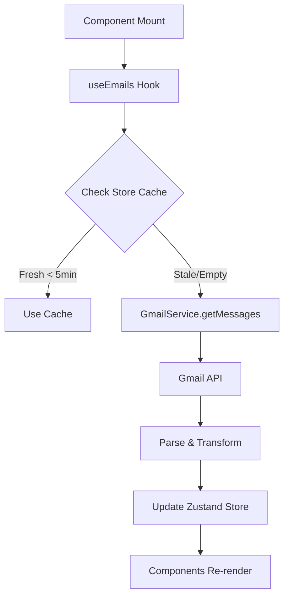
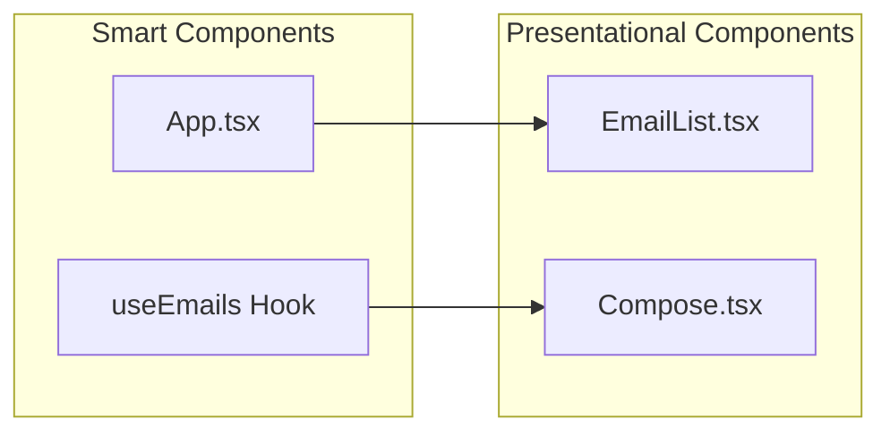
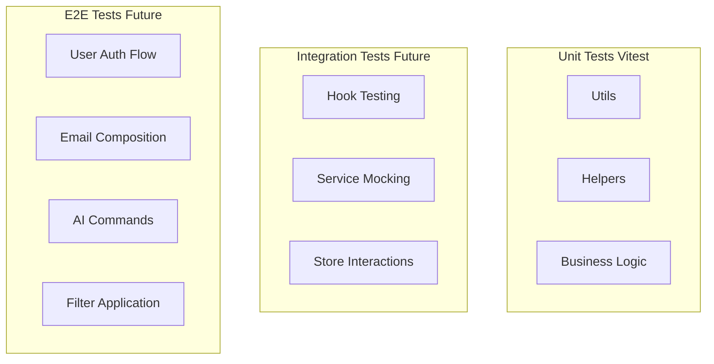

# Architecture Documentation

## System Overview

The AI Mail Assistant is a single-page application built with React that integrates Gmail API with an AI-powered assistant via CopilotKit. The architecture follows a clear separation of concerns with distinct layers for UI, state, business logic, and API integration.



## Key Architectural Decisions

### 1. AI-First Design

The application is designed around the AI assistant as a primary interface, not an add-on. This influences:

- **Action-Oriented Architecture**: All major operations are exposed as CopilotKit actions
- **Context Richness**: The AI is fed comprehensive app state for context awareness
- **UI Visibility**: Every AI action visibly updates the UI, maintaining user trust

```typescript
// AI actions map directly to UI operations
const actions = [
  { name: "navigateToView", handler: (view) => setCurrentView(view) },
  { name: "composeEmail", handler: (data) => setComposeData(data) },
  { name: "searchEmails", handler: (filters) => setFilters(filters) },
  // ...
]
```

### 2. Service Layer Pattern

All external API interactions are abstracted behind service classes:

```typescript
// src/services/gmail.ts
class GmailService {
  private token: string

  async getMessages(label: "inbox" | "sent"): Promise<GmailMessage[]>
  async sendMessage(email: EmailData): Promise<void>
  async modifyMessage(id: string, labels: string[]): Promise<void>
  // ...
}
```

**Benefits:**
- Isolates API complexity from components
- Easy to mock for testing
- Single point for error handling
- Can swap implementations (e.g., add Outlook API)

### 3. State Management with Zustand

Chosen over Redux/Context for:
- **Minimal boilerplate** - No actions, reducers, dispatchers
- **Built-in persistence** - Session survives refresh
- **Type safety** - Excellent TypeScript support
- **Performance** - Selective subscriptions prevent unnecessary re-renders

```typescript
// src/store/useAppStore.ts
interface AppStore {
  // State
  emails: Email[]
  filters: FilterState
  currentView: ViewType

  // Actions
  fetchEmails: () => Promise<void>
  sendEmail: (email: EmailData) => Promise<void>
  setFilters: (filters: Partial<FilterState>) => void
}

export const useAppStore = create<AppStore>()(
  persist(
    (set, get) => ({
      // ... implementation
    }),
    { name: 'ai-mail-storage' }
  )
)
```

### 4. Real-Time Sync Strategy

**Hybrid Approach:**
1. **Polling (Primary)**: 30-second intervals for reliability
2. **WebSocket (Secondary)**: Prepared for Gmail Pub/Sub webhooks

```typescript
// src/hooks/useRealtimeEmailSync.ts
setInterval(() => {
  syncEmails()
}, 30000) // 30 seconds

// WebSocket ready for Pub/Sub integration
socket.on('new-email', (email) => {
  addEmailToStore(email)
  showNotification(email)
})
```

**Rationale:** Pure Pub/Sub requires backend deployment; polling works client-side.

### 5. TypeScript for Type Safety

Comprehensive typing enables:
- Compile-time error checking
- Better IDE autocomplete
- Self-documenting code
- Safer refactoring

## Data Flow

### AI-Initiated Action Flow



### Email Fetching Flow



## Component Architecture

### Container vs Presentational



### CopilotKit Integration

```typescript
// Context Injection
useCopilotReadable({
  description: "Application state",
  value: {
    currentView,
    selectedEmail,
    inboxEmails: emails.inbox.slice(0, 20),
    sentEmails: emails.sent.slice(0, 20),
    filters
  }
})

// Action Registration
useCopilotAction({
  name: "composeEmail",
  description: "Compose a new email",
  parameters: [
    { name: "to", type: "string", required: true },
    { name: "subject", type: "string", required: true },
    { name: "body", type: "string", required: true }
  ],
  handler: async ({ to, subject, body }) => {
    setComposeData({ to, subject, body })
    setCurrentView('compose')
  }
})
```

## Security Considerations

### OAuth 2.0 Flow
- Authorization code flow (not implicit)
- Token stored in localStorage (XSS risk mitigated by httpOnly cookies in production)
- Token refresh implemented
- Client secret never exposed to frontend

### API Security
- Gmail API scopes minimized to `gmail.modify`
- No raw tokens in logs
- Environment variables for credentials

### Future Improvements
- Move token storage to httpOnly cookies
- Implement PKCE for OAuth
- Add CSRF protection
- Rate limiting on API calls

## Error Handling Strategy

```typescript
// Global error boundary
<ErrorBoundary fallback={<ErrorScreen />}>

// Service-level try-catch with user-friendly messages
try {
  await gmailService.sendMessage(email)
} catch (error) {
  if (error.code === 401) {
    showAuthError()
  } else if (error.code === 429) {
    showRateLimitError()
  } else {
    showGenericError()
  }
}

// Hook-level error state
const [error, setError] = useState<string | null>(null)
```

## Performance Optimizations

1. **Lazy Loading**: Large email bodies fetched on-demand
2. **Debouncing**: Search input debounced to reduce API calls
3. **Memoization**: Expensive computations cached with useMemo
4. **Pagination**: Emails loaded in batches (max 50 per request)
5. **Virtual Scrolling**: Considered for large lists (not implemented)

## Testing Strategy



## Deployment Considerations

### Frontend (Vercel/Netlify)
- Static build with `npm run build`
- Environment variables configured in platform
- OAuth redirect URI updated to production domain

### Backend (For Pub/Sub)
- Express server for Gmail webhook handling
- Google Cloud Pub/Sub subscription
- WebSocket server (Socket.io)
- Could use Cloud Functions, Railway, or Render

## Extension Points

The architecture supports adding:

1. **Other Email Providers**: Implement `EmailService` interface for Outlook/IMAP
2. **More AI Actions**: Register additional CopilotKit actions
3. **Custom Views**: Add to `ViewType` union and handle in routing
4. **Advanced Filters**: Extend `FilterState` interface
5. **Offline Support**: Service worker + IndexedDB for cache

## Technical Debt & Known Limitations

1. **No attachment handling** - Gmail API returns attachment IDs separately
2. **Thread view is basic** - Emails grouped by threadId but not visually connected
3. **No draft saving** - Compose modal has no auto-save
4. **Polling is 30s** - Balance between freshness and quota
5. **No retry logic** - Failed API calls show error but don't retry
6. **Type assertions** - Some Gmail API responses use `as` for complex types

## References

- [Gmail API Documentation](https://developers.google.com/gmail/api)
- [CopilotKit Documentation](https://docs.copilotkit.ai)
- [Zustand Guide](https://zustand-demo.pmnd.rs)
- [OAuth 2.0 for Google](https://developers.google.com/identity/protocols/oauth2)
