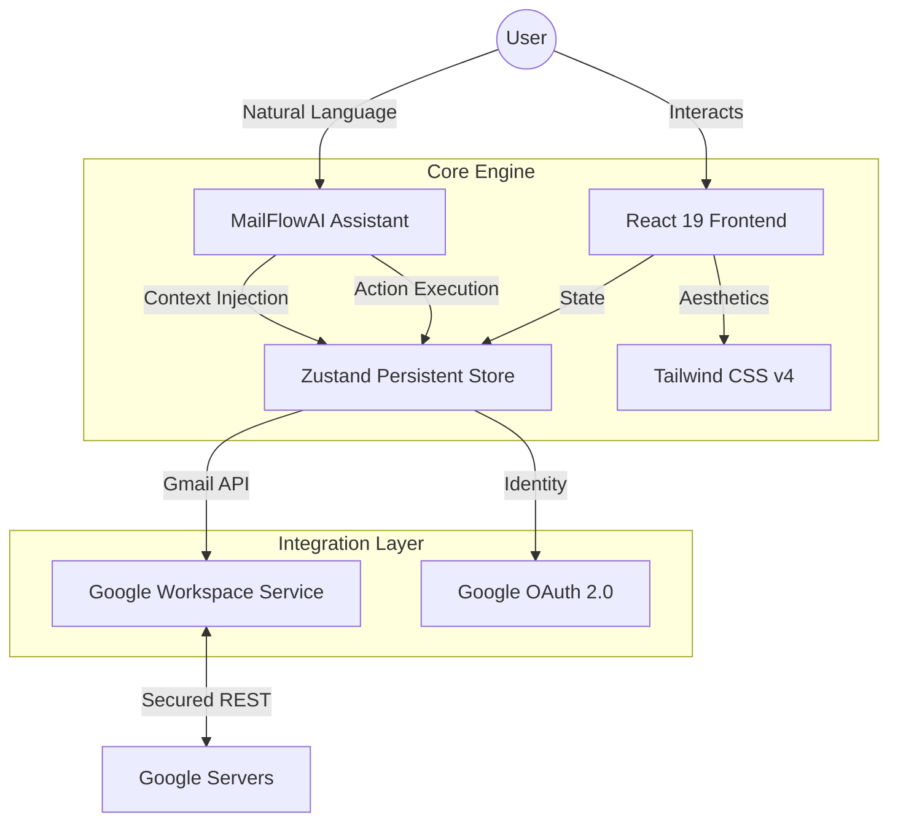

# MailFlowAI

[](https://mail-flow-ai.vercel.app)
[](https://react.dev)
[](https://tailwindcss.com)

**MailFlowAI** is a premium, AI-powered email assistant designed for high-performance productivity. Built with React 19 and Tailwind CSS v4, it offers a seamless, agentic experience for managing your Gmail inbox through natural language.


---

## ✨ Key Features

- **🤖 AI-Agentic Workflow**: Integrated CopilotKit assistant that understands your inbox context and can compose, search, and manage emails via natural language prompts.
- **⚡ Supercharged Interface**: Ultra-responsive layout with glassmorphic aesthetics, smooth transitions, and a premium dark-mode-first design.
- **🛡️ Secure Google OAuth 2.0**: Direct, client-side authentication with Google, keeping your data secure and private.
- **🔄 Real-time Intelligence**: Periodic background sync with visual feedback, ensuring your inbox is always up to date.
- **🔍 Smart Filtering**: Instant subject, sender, and content filtering with persistent pagination.

---

## 🏗️ Visual Architecture



---

## 🚀 Getting Started

### Prerequisites

- **Node.js 20+**
- **Google Cloud Project** with Gmail API enabled
- **OAuth 2.0 Client ID** (Web Application type)

### 1. Setup Environment

Clone the repository and install dependencies:

```bash
npm install
cp .env.example .env
```

Configure your `.env` with the following variables:

```env
# Google OAuth Configuration
VITE_GMAIL_CLIENT_ID=your-client-id.apps.googleusercontent.com
VITE_GMAIL_CLIENT_SECRET=your-client-secret
VITE_GMAIL_REDIRECT_URI=http://localhost:3000/auth/callback

# CopilotKit AI Configuration
VITE_COPILOT_API_KEY=your-api-key
```

### 2. Run Locally

```bash
npm run dev
```

Visit `http://localhost:3000` to start your session.

---

## 🛠️ Technical Decisions

| Category | Decision | Rationale |
| :--- | :--- | :--- |
| **State** | **Zustand** | Minimal boilerplate, high performance, and built-in persistence for offline recovery. |
| **AI** | **CopilotKit** | Native React integration for readable context and action-driven UI control. |
| **Styling** | **Tailwind v4** | CSS-first configuration and lightning-fast build times. |
| **Auth** | **OAuth 2.0** | Industry-standard security with scoped access to Gmail data. |

---

## 🔮 Roadmap

- [ ] **Multi-account Routing**: Seamless switching between multiple Google accounts.
- [ ] **Threaded Conversations**: Advanced grouping of email chains.
- [ ] **Native Attachments**: Drag-and-drop file management through the AI assistant.
- [ ] **Draft Persistence**: Cloud-synced draft management.
- [ ] **E2E Stability**: Comprehensive Playwright test suite for critical flows.

---

*Built with ❤️ by the MailFlowAI Team.*
