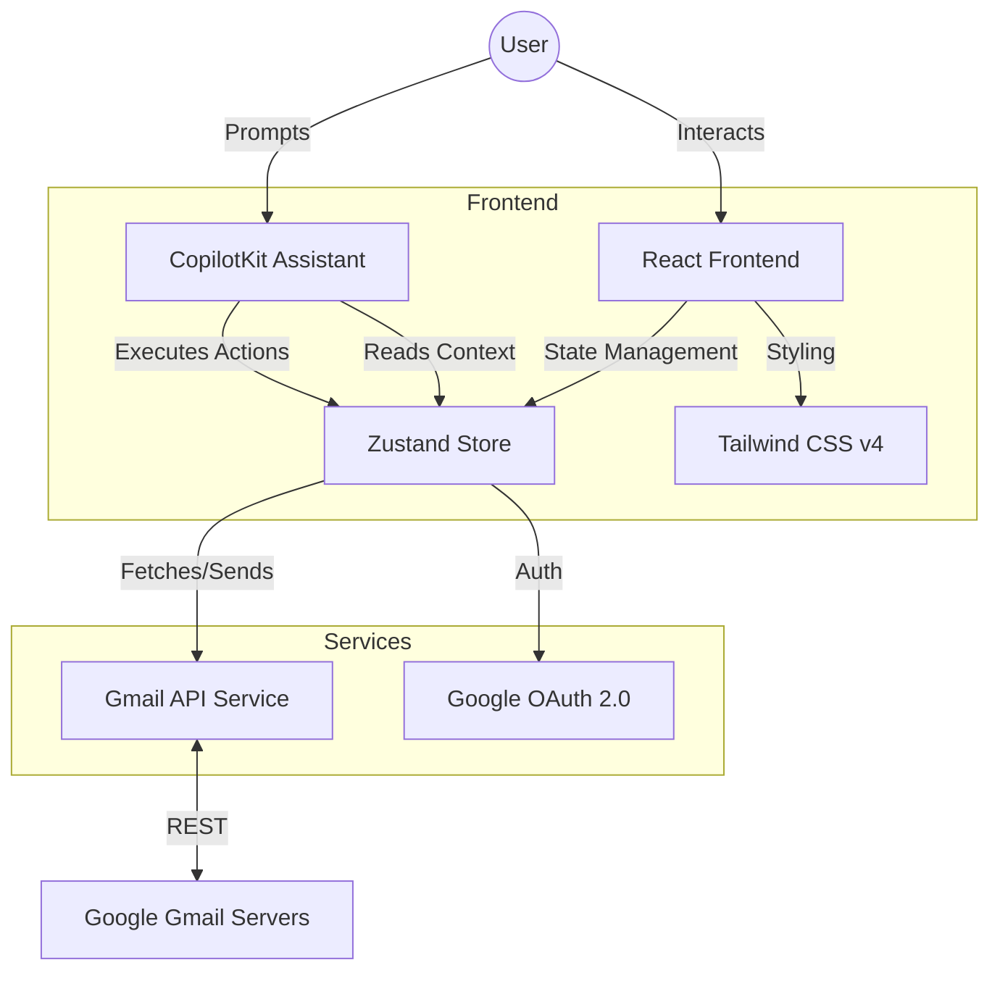

# AI Mail Assistant

An AI-powered email application with Gmail integration and CopilotKit AI assistant for natural language control.

## Demo

<video src="public/demo.mp4" controls title="Demo Video" width="100%"></video>


## Visual Architecture



## How to Set It Up and Run It Locally

### Prerequisites

- Node.js 20+
- Google Cloud Project with Gmail API enabled
- OAuth 2.0 credentials

### Installation

1. **Configure Google Cloud**

   - Enable Gmail API in Google Cloud Console
   - Create OAuth 2.0 credentials (Web application)
   - Set authorized origin: `http://localhost:3000`
   - Set redirect URI: `http://localhost:3000/auth/callback`
2. **Install Dependencies**

   ```bash
   npm install
   ```
3. **Configure Environment**

   ```bash
   cp .env.example .env
   ```

   Edit `.env` with your credentials:

   ```env
   VITE_GMAIL_CLIENT_ID=your-client-id.apps.googleusercontent.com
   VITE_GMAIL_CLIENT_SECRET=your-client-secret
   VITE_GMAIL_REDIRECT_URI=http://localhost:3000/auth/callback
   ```
4. **Run the Application**

   ```bash
   npm run dev
   ```

   Open http://localhost:3000 and sign in with Google.

## Architecture Decisions & Trade-offs

### 1. CopilotKit for AI Integration

**Decision:** Used CopilotKit instead of building a custom AI backend.
**Rationale:** Provides `useCopilotReadable` for context injection and `useCopilotAction` for callable functions with type safety. It significantly reduces development time for AI-controlled UIs.
**Trade-off:** Vendor dependency, but mitigated by clear action interfaces that could be replaced if necessary.

### 2. Zustand for State Management

**Decision:** Zustand over Redux or Context API.
**Rationale:** Offers minimal boilerplate, better performance than Context API (avoiding unnecessary re-renders), and built-in persistence via middleware.
**Trade-off:** Smaller ecosystem than Redux, but simpler and sufficient for this application's complexity.

### 3. Polling for Real-time Sync

**Decision:** 30-second polling instead of pure Pub/Sub push notifications.
**Rationale:** Gmail Pub/Sub requires a dedicated backend server with authenticated webhooks. Polling works entirely client-side without additional infrastructure complexity for this scope.
**Trade-off:** Updates are not instant (up to 30s delay), but acceptable for standard email usage.

### 4. React 19 & Tailwind CSS v4

**Decision:** Adopted latest versions (React 19, Tailwind v4).
**Rationale:** React 19 offers improved compiler optimizations and Suspense support. Tailwind v4 provides a significantly faster engine and CSS-first configuration.
**Trade-off:** Newer tools may have fewer community resources or edge-case documentation, but offer better long-term maintainability.

## What I'd Improve With More Time

1. **True Push Notifications**: Implement a backend webhook server to support Gmail Pub/Sub for instant email delivery.
2. **Conversation View**: Group emails by thread with expanded/collapsed replies for better conversation tracking.
3. **Attachment Support**: Add functionality to view and send file attachments.
4. **Email Actions**: Implement archive, delete, label, and star functionality.
5. **Advanced Search UI**: Create a visual interface for complex queries (date pickers, sender autocomplete).
6. **Draft Management**: Allow saving and resuming draft emails.
7. **Multiple Accounts**: Support switching between different Gmail accounts.
8. **E2E Tests**: Integrate Playwright for full user flow testing.
