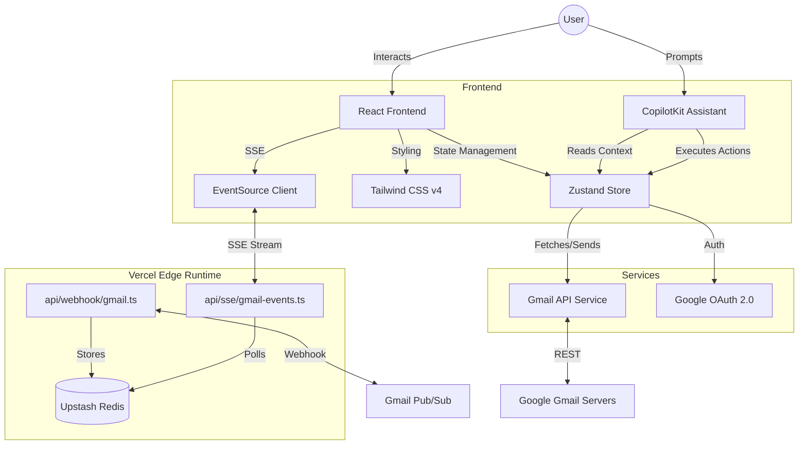

# AI Mail Assistant

An AI-powered email application with Gmail integration and CopilotKit AI assistant for natural language control.

## Demo

<video src="public/demo.mp4" controls title="Demo Video" width="100%"></video>


## Visual Architecture



## How to Set It Up and Run It Locally

### Prerequisites

- Node.js 20+
- Google Cloud Project with Gmail API enabled
- OAuth 2.0 credentials
- Upstash Redis account (for Vercel deployment)

### Installation

1. **Configure Google Cloud**

   - Enable Gmail API in Google Cloud Console
   - Create OAuth 2.0 credentials (Web application)
   - Set authorized origin: `http://localhost:3000`
   - Set redirect URI: `http://localhost:3000/auth/callback`

2. **Configure Upstash Redis** (for real-time sync)

   - Create a free Redis database at https://upstash.com/
   - Get your REST API URL and token from the dashboard

3. **Install Dependencies**

   ```bash
   npm install
   ```

4. **Configure Environment**

   ```bash
   cp .env.example .env
   ```

   Edit `.env` with your credentials:

   ```env
   # Google OAuth
   VITE_GMAIL_CLIENT_ID=your-client-id.apps.googleusercontent.com
   VITE_GMAIL_CLIENT_SECRET=your-client-secret
   VITE_GMAIL_REDIRECT_URI=http://localhost:3000/auth/callback

   # Upstash Redis (for SSE)
   KV_REST_API_URL=https://your-redis.upstash.io
   KV_REST_API_TOKEN=your-redis-token

   # Gmail Pub/Sub Verification (optional, for webhook security)
   GOOGLE_PUBSUB_VERIFICATION_TOKEN=your-secret-token
   ```

5. **Run the Application**

   ```bash
   npm run dev
   ```

   Open http://localhost:3000 and sign in with Google.

### Vercel Deployment

This application is configured for Vercel Edge Runtime:

1. Push your code to GitHub
2. Import project in Vercel
3. Add environment variables in Vercel dashboard
4. Deploy - Edge functions automatically handle SSE endpoints

## Architecture Decisions & Trade-offs

### 1. Server-Sent Events (SSE) for Real-time Sync

**Decision:** Migrated from Socket.IO (WebSocket) to SSE with Vercel Edge Runtime.
**Rationale:**
- Vercel serverless functions don't support WebSocket connections
- SSE provides one-way push from server to client, sufficient for email notifications
- Edge Runtime enables global low-latency responses
- Upstash Redis provides shared state across edge function instances
**Trade-off:** SSE is unidirectional (server→client). Client actions use standard REST API calls.

### 2. CopilotKit for AI Integration

**Decision:** Used CopilotKit instead of building a custom AI backend.
**Rationale:** Provides `useCopilotReadable` for context injection and `useCopilotAction` for callable functions with type safety. It significantly reduces development time for AI-controlled UIs.
**Trade-off:** Vendor dependency, but mitigated by clear action interfaces that could be replaced if necessary.

### 3. Zustand for State Management

**Decision:** Zustand over Redux or Context API.
**Rationale:** Offers minimal boilerplate, better performance than Context API (avoiding unnecessary re-renders), and built-in persistence via middleware.
**Trade-off:** Smaller ecosystem than Redux, but simpler and sufficient for this application's complexity.

### 4. Upstash Redis for Event Storage

**Decision:** Use Upstash Redis instead of Vercel KV for shared event storage.
**Rationale:** Vercel KV was deprecated; Upstash provides a free tier with REST API compatible with Edge Runtime. Stores events for 5 minutes with automatic expiration.
**Trade-off:** 5-minute TTL means events older than 5 minutes are lost if clients are disconnected.

### 5. React 19 & Tailwind CSS v4

**Decision:** Adopted latest versions (React 19, Tailwind v4).
**Rationale:** React 19 offers improved compiler optimizations and Suspense support. Tailwind v4 provides a significantly faster engine and CSS-first configuration.
**Trade-off:** Newer tools may have fewer community resources or edge-case documentation, but offer better long-term maintainability.

## Real-time Email Sync Architecture

The application uses a hybrid approach for real-time email updates:

### Primary: SSE (Server-Sent Events)

1. Gmail sends Pub/Sub push notification to `/api/webhook/gmail`
2. Webhook stores event in Upstash Redis (LPUSH)
3. SSE endpoint `/api/sse/gmail-events` polls Redis every second
4. New events are pushed to connected clients via EventSource
5. Client receives `email:new` event and triggers immediate sync

### Fallback: Polling

- 30-second polling interval runs in parallel
- Ensures updates even if SSE connection fails
- Automatic reconnection with exponential backoff (1s → 30s max)

### Browser Notifications

- Requests permission on first connection
- Shows "New Email Received" notification on `email:new` event

## What I'd Improve With More Time

1. **Multi-account Support**: Support switching between different Gmail accounts
2. **Conversation View**: Group emails by thread with expanded/collapsed replies
3. **Attachment Support**: Add functionality to view and send file attachments
4. **Email Actions**: Implement archive, delete, label, and star functionality
5. **Advanced Search UI**: Create a visual interface for complex queries (date pickers, sender autocomplete)
6. **Draft Management**: Allow saving and resuming draft emails
7. **E2E Tests**: Integrate Playwright for full user flow testing
8. **Webhook Security**: Implement HMAC signature verification for production webhooks
